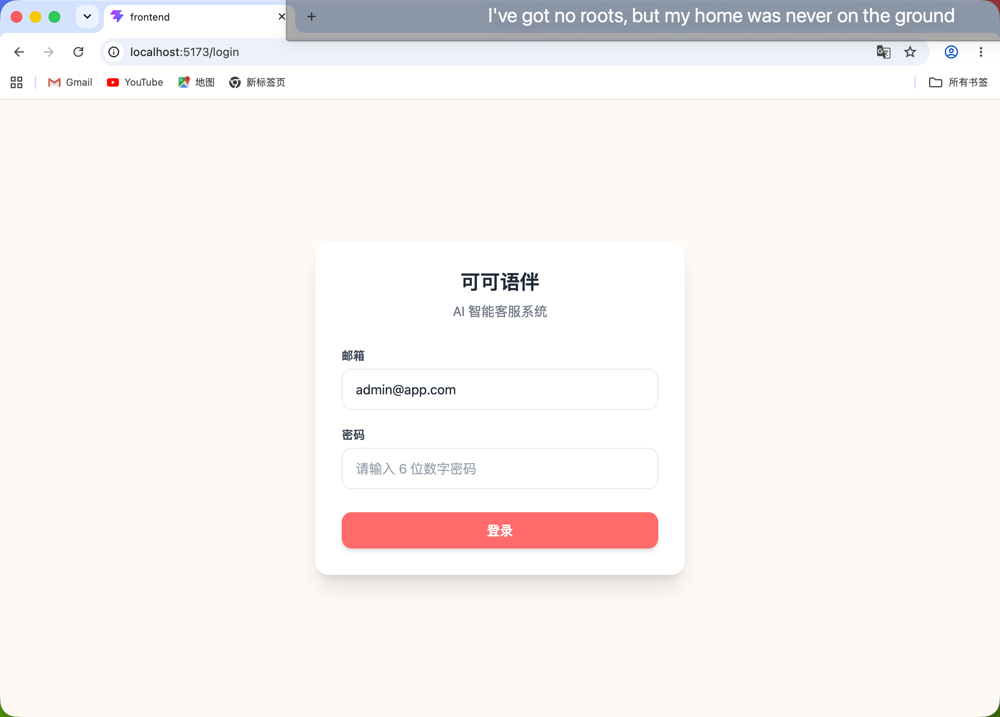
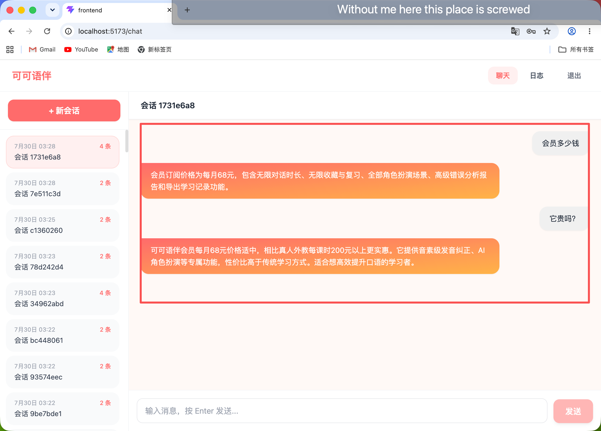
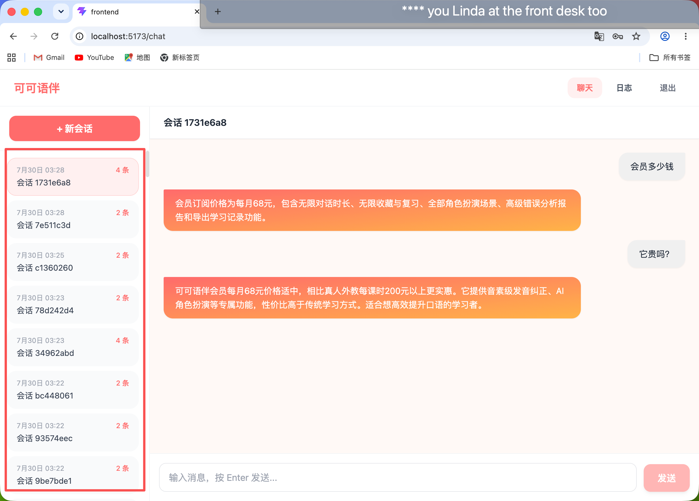
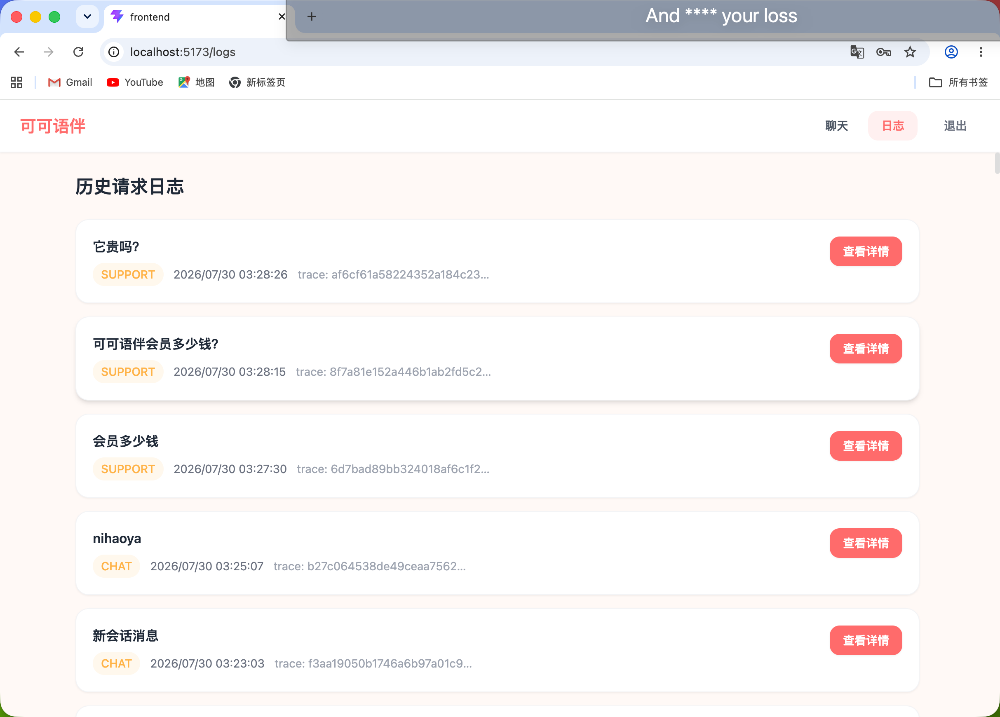
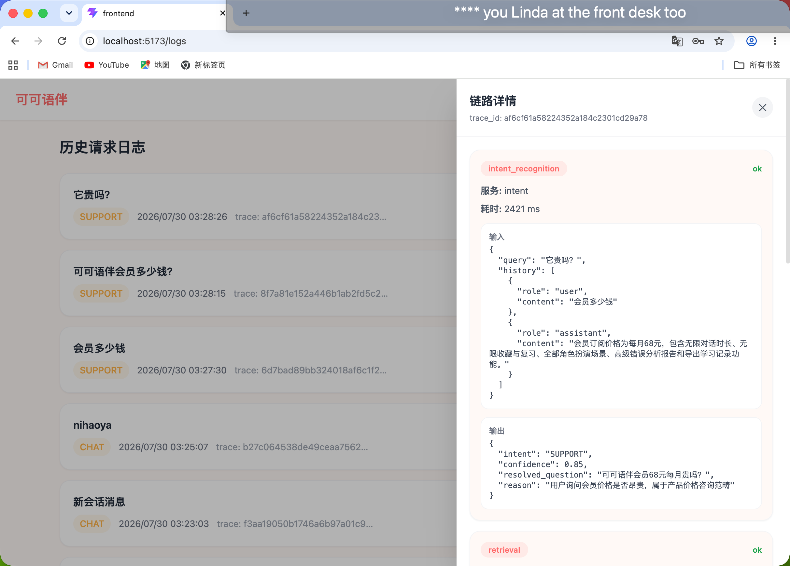
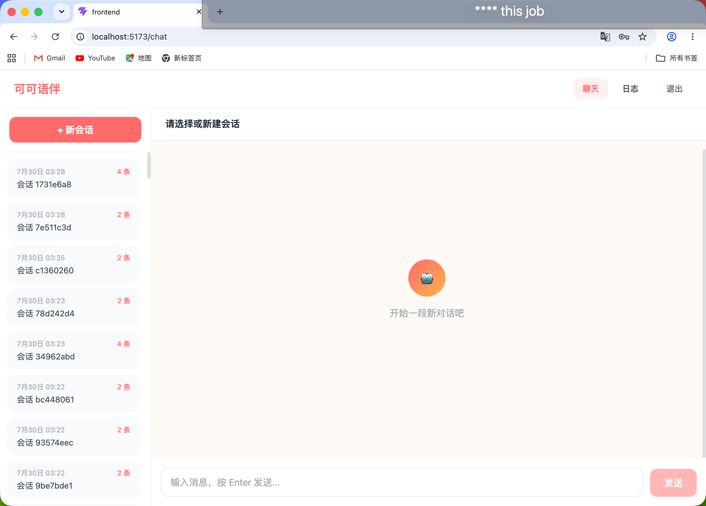

# 可可语伴 AI 智能客服系统

> 一个基于 RAG（检索增强生成）架构的 AI 智能客服助手，为 AI 外语学习产品「可可语伴（CocoMate）」提供智能问答服务。








## 技术栈

- **后端**: Python 3.13 + FastAPI + SQLAlchemy (async) + aiosqlite
- **前端**: React 18 + TypeScript + Vite + TailwindCSS + Zustand + Axios
- **AI**: DeepSeek-V3 + FAISS + FTS5 + RRF + qwen3-rerank
- **测试**: pytest（48 个用例）

## 功能特性

- 智能意图识别（SUPPORT / FEEDBACK / CHAT）
- RAG 混合检索（FAISS 语义检索 + FTS5 BM25 + RRF 融合 + qwen3-rerank 重排）
- JWT 鉴权与会话管理
- 多轮对话与指代消解
- 全链路日志追踪（意图识别 → 检索 → 重排 → LLM 生成）

## 快速开始

### 环境要求

- Python 3.13+（推荐使用 [uv](https://docs.astral.sh/uv/) 管理）
- Node.js 22+
- 需要配置 `DASHSCOPE_API_KEY` 和 `WORKSPACE_ID` 环境变量（参考 `backend/.env.example`）

### 1. 启动后端

```bash
cd backend
cp .env.example .env   # 填写 DASHSCOPE_API_KEY 和 WORKSPACE_ID
uv run uvicorn app.main:app --reload --host 0.0.0.0 --port 8000
```

### 2. 启动前端

```bash
cd frontend
npm install
npm run dev
```

### 3. 访问

浏览器打开 http://localhost:5173 ，使用以下账号登录：

| 账号 | 密码 |
| :--- | :--- |
| `admin@app.com` | `123456` |

### 4. 运行测试

```bash
cd backend
uv run python -m pytest tests/ -v
```

## 演示脚本（面试 / 客户演示推荐）

### 场景一：登录 + 基础问答

1. 打开 http://localhost:5173 → 自动跳转 `/login`
2. 输入 `admin@app.com` / `123456` 登录
3. 输入"会员多少钱？" → 收到回答包含"68元/月"

### 场景二：多轮对话 + 指代消解

1. 输入"可可语伴会员多少钱？"
2. 接着输入"它贵吗？" → AI 正确理解"它"指会员，回答"每月68元"

### 场景三：日志链路展示

1. 点击顶部导航「日志」
2. 点击任意一条记录「查看详情」
3. 展示 4 个节点链路：意图识别 → 知识检索 → 重排序 → LLM 生成

### 场景四：意图识别对比

| 输入 | 预期意图 | 说明 |
| :--- | :--- | :--- |
| 你好呀 | CHAT | 闲聊直接回复 |
| 会员多少钱？ | SUPPORT | 走知识库检索 |
| 没有声音怎么办？ | FEEDBACK | 故障反馈处理 |

## 项目结构

```
coco-agent/
├── backend/              # FastAPI 后端（RAG 全链路）
│   ├── app/
│   │   ├── routers/      # 路由（auth/chat/sessions/logs）
│   │   ├── services/     # 业务服务（意图/检索/重排/LLM）
│   │   ├── utils/        # 日志工具
│   │   └── config.py     # 配置
│   └── tests/            # 48 个 pytest 用例
├── frontend/             # React 前端
│   └── src/
│       ├── api/          # Axios API 封装
│       ├── store/        # Zustand 状态管理
│       ├── pages/        # 登录/聊天/日志页面
│       └── components/   # UI 组件
├── knowledge_base/       # 知识库文档
├── screenshots/          # 界面截图
├── test_cases.csv        # 黄金测试集（20 条）
└── test_report_automated.md  # 自动化测试报告
```

## 测试报告摘要

| 维度 | 通过率 |
| :--- | :--- |
| 意图识别准确率 | 100%（20/20） |
| 关键词命中率 | 95%（19/20） |
| 检索命中率 | 100%（5/5） |
| 指代消解 | ✅ |
| 路由守卫 / Token 持久化 / 状态管理 | ✅ |

详见 [test_report_automated.md](test_report_automated.md)
